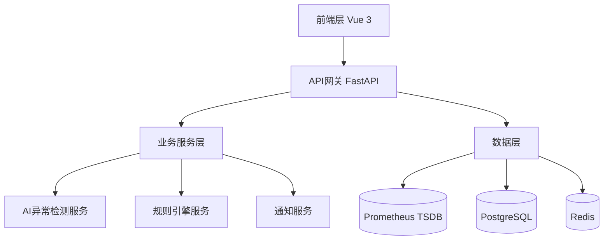
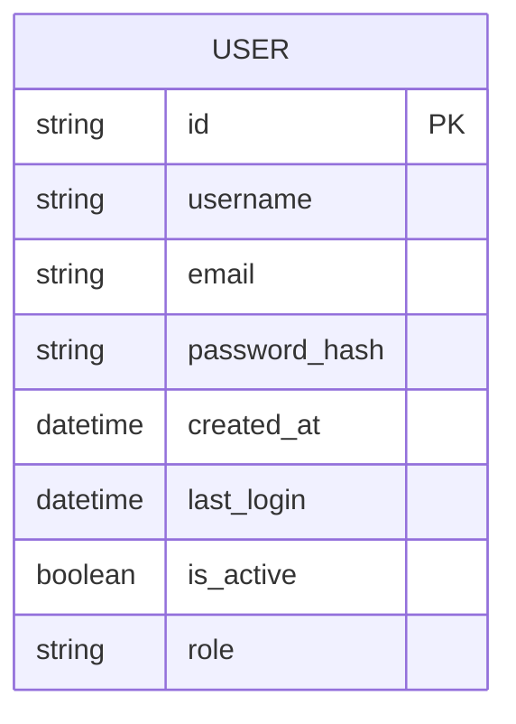
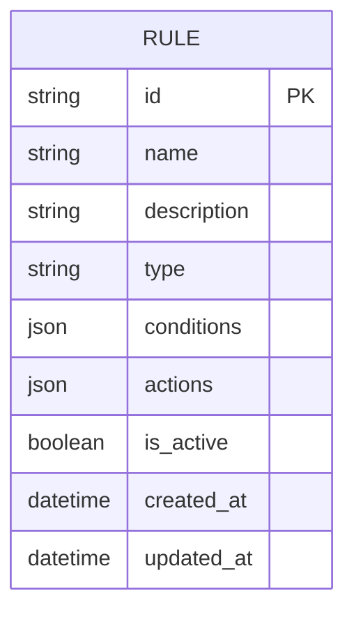
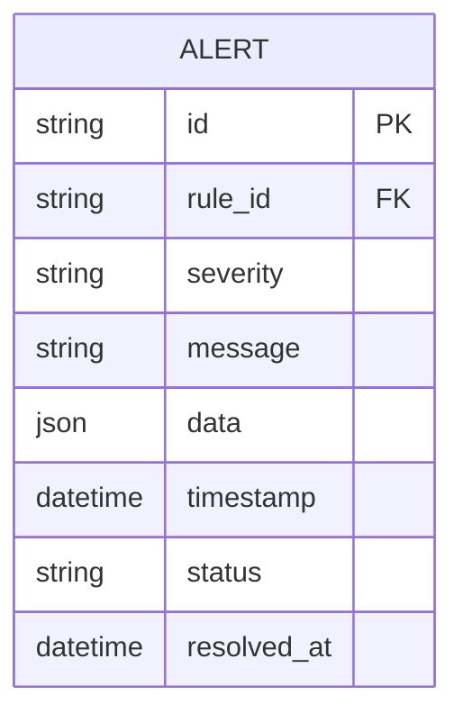
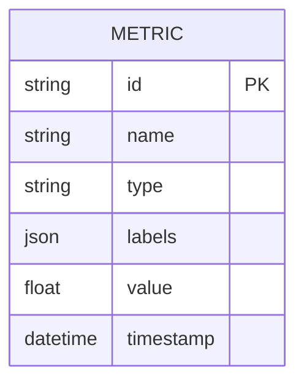

# 自动化巡检与智能预警系统设计文档

## 1. 系统概述

### 1.1 系统目标

自动化巡检与智能预警系统旨在通过AI驱动的异常检测和多渠道智能通知功能，实现对IT基础设施的实时监控和预警。系统主要目标包括：

- 实现**自动化巡检**：定时采集系统指标（CPU、内存、网络、磁盘等）、服务状态及日志信息
- 实现**智能预警**：通过规则引擎和AI异常检测模块分析指标，及时发现异常
- 支持**多渠道通知**：包括Slack、Email等
- 提供**可视化前端仪表盘**：直观展示时序数据、异常告警和系统健康状态
- 使用**Python 3.11** + **Node 22.11**，确保环境统一

### 1.2 核心功能

1. **AI驱动的异常检测**：基于机器学习算法（Isolation Forest、Z-Score、LSTM、Prophet）实现智能异常识别
2. **高性能实时数据可视化**：使用ECharts 5+进行大数据量渲染，支持实时监控仪表盘
3. **可配置的规则引擎系统**：支持动态规则配置和条件组合逻辑
4. **多渠道智能通知**：支持Slack、Email等通知方式，具备告警聚合去重功能
5. **预测性预警分析**：基于时间序列预测技术，实现预测性维护
6. **交互式监控仪表盘**：提供丰富的可视化组件和交互体验

## 2. 系统架构设计

### 2.1 整体架构



### 2.2 数据层

- **Prometheus**：采集系统指标，存储TSDB
- **PostgreSQL**：存储结构化数据（用户账户、权限信息、规则配置等）
- **Redis**：缓存热点数据，支持会话管理和消息队列

### 2.3 后端层

- **Python 3.11 + FastAPI**：提供高性能RESTful API
- **功能模块**：
  - 数据聚合与处理
  - AI异常检测引擎
  - 规则引擎服务
  - 多渠道通知接口

### 2.4 AI层

- **机器学习算法**：
  - Isolation Forest（孤立森林）：无监督异常检测
  - Z-Score统计方法：基于标准分数的统计异常检测
  - LSTM神经网络：深度学习时间序列预测
  - Prophet时间序列：Facebook开源的时间序列预测算法
- **AI服务模块**：
  - 数据预处理与特征工程
  - 模型训练与管理
  - 异常评分与严重程度分析
  - 预测性预警分析

### 2.5 前端层

- **Vue 3 + TypeScript + Element Plus**：现代化前端框架
- **功能要求**：
  - 仪表盘展示：折线图、柱状图、饼图
  - 异常高亮显示
  - 可自定义时间范围
  - 响应式设计，支持桌面端和移动端
- **优化方向**：
  - 使用ECharts或Apache ECharts，充分利用GPU加速渲染
  - 懒加载数据，减少首次渲染压力
  - 数据缓存与分页，提升大数据量展示性能
  - 前端计算轻量化，只处理可视数据，后台做复杂计算

### 2.6 通知层

- **支持渠道**：Slack、Email
- **功能特性**：
  - 异常信息支持Markdown富文本或HTML格式
  - 可配置通知规则（阈值、重复告警间隔）
  - 支持告警去重、延迟发送策略
  - 多租户通知配置

## 3. 功能模块设计

### 3.1 数据采集模块

- **Prometheus查询API**：周期性拉取指标
- **支持范围**：多主机、多数据库、多应用
- **数据源**：
  - 系统指标（CPU、内存、网络、磁盘）
  - 应用性能指标
  - 业务指标

### 3.2 异常检测模块

- **AI异常检测服务**：
  - 输入：时序数据
  - 输出：异常分数 + 告警等级
- **算法支持**：
  - Isolation Forest（孤立森林）
  - Z-Score统计方法
  - LSTM神经网络
  - Prophet时间序列
- **检测场景**：
  - 单表检测
  - 全量备份检测
  - 增量备份检测

### 3.3 通知与告警模块

- **告警类型**：
  - 阈值告警
  - 异常预测告警
- **通知功能**：
  - 通知模板可定制
  - 支持告警去重、延迟发送策略
  - 高频告警聚合，避免重复打扰
  - 支持告警等级显示

### 3.4 前端可视化模块

- **数据展示**：
  - 时间序列折线图
  - CPU、内存、磁盘使用率实时曲线
  - 异常点标记
- **性能优化**：
  - ECharts使用`large`模式渲染大数据量
  - 图表懒加载和分页
  - 使用虚拟滚动加载表格数据
- **交互体验**：
  - 可拖拽调整图表布局
  - 自定义告警颜色和图标
  - 鼠标悬停显示详细数据
- **移动端适配**：
  - 响应式布局，折线图可缩放
  - 简化移动端数据量，降低渲染压力

### 3.5 规则引擎模块

- **功能特性**：
  - 动态规则配置
  - 条件组合逻辑
  - 规则执行调度
  - 规则版本管理
- **规则类型**：
  - 阈值规则
  - 趋势规则
  - 复合规则

## 4. 技术选型

| 模块           | 技术                        | 优势                           |
| -------------- | --------------------------- | ------------------------------ |
| 数据采集       | Prometheus                  | 高性能，支持多维度查询         |
| 后端           | Python 3.11 + FastAPI       | 高性能、异步支持、扩展性好     |
| AI异常检测     | Scikit-learn, Statsmodels   | 易于训练和部署                 |
| 前端           | Vue 3 + TypeScript + ECharts| 响应式、可视化强、支持大数据量 |
| 通知           | Slack API, SMTP             | 多渠道、易集成                 |
| 数据库         | PostgreSQL, Redis           | 高性能、可靠性强               |
| 容器化         | Docker                      | 环境统一、便于部署             |

## 5. API接口设计

### 5.1 异常检测API

- `POST /api/v1/anomaly/detect`：执行异常检测分析
- `POST /api/v1/anomaly/predict`：时间序列预测
- `GET /api/v1/anomaly/algorithms`：获取支持的算法列表
- `GET /api/v1/anomaly/models/info`：获取模型信息

### 5.2 指标查询API

- `GET /api/v1/metrics`：获取指标数据
- `GET /api/v1/metrics/{name}/history`：获取指标历史数据

### 5.3 规则管理API

- `GET /api/v1/rules`：获取规则列表
- `POST /api/v1/rules`：创建规则
- `PUT /api/v1/rules/{id}`：更新规则
- `DELETE /api/v1/rules/{id}`：删除规则

### 5.4 通知管理API

- `GET /api/v1/notifications`：获取通知列表
- `GET /api/v1/notifications/channels`：获取通知渠道

### 5.5 系统管理API

- `GET /api/v1/system/info`：获取系统信息
- `GET /api/v1/system/services`：获取系统服务状态
- `GET /api/v1/system/health`：获取系统健康状态

## 6. 数据模型设计

### 6.1 用户模型



### 6.2 规则模型



### 6.3 告警模型



### 6.4 指标模型



## 7. 部署架构

### 7.1 容器化部署

- **Docker Compose**：用于开发环境和简单生产环境
- **Kubernetes**：用于复杂生产环境
- **镜像管理**：前后端分离镜像构建

### 7.2 服务编排

```yaml
version: '3.8'
services:
  frontend:
    build: ./frontend
    ports:
      - "3000:80"
    depends_on:
      - backend
  
  backend:
    build: ./backend
    ports:
      - "8000:8000"
    environment:
      - DATABASE_URL=postgresql://user:pass@db:5432/monitoring
      - PROMETHEUS_URL=http://prometheus:9090
    depends_on:
      - db
      - redis
      - prometheus
  
  db:
    image: postgres:15
    environment:
      - POSTGRES_DB=monitoring
      - POSTGRES_USER=user
      - POSTGRES_PASSWORD=pass
    volumes:
      - postgres_data:/var/lib/postgresql/data
  
  redis:
    image: redis:7
    command: redis-server --appendonly yes
    volumes:
      - redis_data:/data
  
  prometheus:
    image: prom/prometheus
    ports:
      - "9090:9090"
    volumes:
      - ./prometheus/prometheus.yml:/etc/prometheus/prometheus.yml
      - prometheus_data:/prometheus

volumes:
  postgres_data:
  redis_data:
  prometheus_data:
```

### 7.3 环境要求

- **Python**：3.11+
- **Node.js**：22.11+
- **Vue**：3+
- **ECharts**：5+
- **Prometheus**：最新稳定版本
- **Docker**：23+（容器部署）

## 8. 性能优化策略

### 8.1 前端优化

1. **数据处理优化**：
   - 后端尽量返回可直接展示的数据
   - 前端只做轻量渲染和交互

2. **图表优化**：
   - 大数据量使用`dataset` + `large`模式
   - 时间轴支持缩放、滑动
   - 图表懒加载和分页
   - 使用虚拟滚动加载表格数据

3. **响应式设计**：
   - 移动端适配，简化数据量
   - 响应式布局，支持不同屏幕尺寸

### 8.2 后端优化

1. **数据库优化**：
   - 索引优化
   - 查询缓存
   - 连接池管理

2. **AI服务优化**：
   - 模型缓存
   - 异步处理
   - 批量计算

3. **API优化**：
   - 响应压缩
   - 分页查询
   - 结果缓存

## 9. 安全设计

### 9.1 认证授权

- **JWT Token**：基于JSON Web Token的认证机制
- **RBAC权限控制**：基于角色的访问控制
- **API密钥管理**：支持服务间安全调用

### 9.2 数据安全

- **传输加密**：HTTPS协议
- **数据加密**：敏感数据加密存储
- **访问控制**：细粒度权限管理

### 9.3 应用安全

- **输入验证**：防止SQL注入、XSS攻击
- **速率限制**：防止单点过载
- **日志审计**：记录关键操作日志

## 10. 可扩展性设计

### 10.1 模块化设计

- **插件化架构**：支持功能模块动态扩展
- **微服务架构**：服务间松耦合
- **API网关**：统一入口管理

### 10.2 AI模型扩展

- **算法可替换**：支持多种机器学习算法
- **模型版本管理**：支持模型迭代更新
- **自定义模型**：支持用户自定义模型集成

### 10.3 通知渠道扩展

- **插件化通知**：支持新增通知渠道
- **模板化配置**：支持自定义通知模板
- **多租户支持**：支持不同租户的通知配置

## 11. 监控与运维

### 11.1 系统监控

- **服务健康检查**：定期检查各服务状态
- **性能指标监控**：监控系统资源使用情况
- **日志收集分析**：集中日志管理和分析

### 11.2 运维工具

- **Docker容器管理**：容器化部署和管理
- **CI/CD流水线**：自动化构建和部署
- **配置管理**：环境配置统一管理