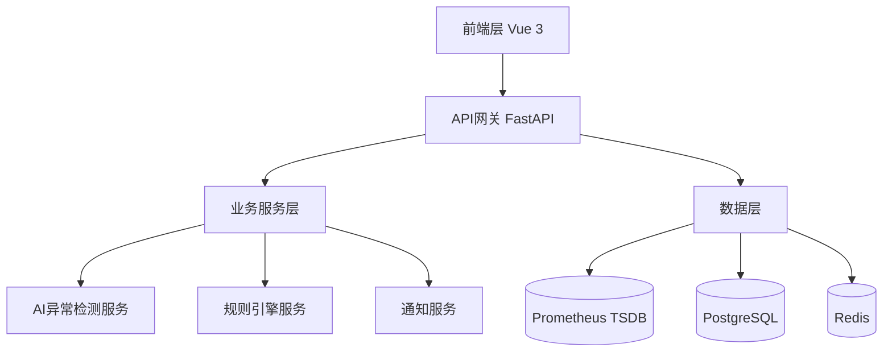

# 智能监控预警系统

## 项目简介

基于Python 3.11 + Vue 3构建的专家级自动化巡检与智能预警系统，采用微服务架构设计，提供AI驱动的异常检测和多渠道智能通知功能。

## 核心特性

🔥 **核心功能**
- 🤖 AI驱动的异常检测 (Isolation Forest, LSTM, Prophet)  
- 📊 高性能实时数据可视化 (ECharts 5+ 大数据渲染)
- 🔧 可配置的规则引擎系统
- 📱 多渠道智能通知 (Slack, Email, Webhook)
- 🎯 预测性预警分析
- 📈 交互式监控仪表盘

🏗️ **技术架构**
- **后端**: Python 3.11 + FastAPI + SQLAlchemy 2.0
- **前端**: Vue 3 + TypeScript + ECharts 5 + Element Plus
- **数据**: Prometheus + PostgreSQL + Redis
- **AI/ML**: Scikit-learn + Pandas + NumPy
- **部署**: Docker + Docker Compose

## 项目结构

```
smart-monitoring/
├── docs/                    # 📚 项目文档
│   ├── architecture.md      # 架构设计文档
│   ├── api.md              # API接口文档
│   ├── deployment.md       # 部署指南
│   └── github-setup.md     # GitHub上传指南
├── backend/                 # 🐍 Python后端服务
│   ├── app/                # 主应用模块
│   │   ├── api/            # API路由
│   │   ├── core/           # 核心配置
│   │   ├── models/         # 数据模型
│   │   ├── services/       # 业务服务
│   │   └── utils/          # 工具函数
│   ├── alembic/            # 数据库迁移
│   ├── tests/              # 测试用例
│   ├── requirements.txt    # Python依赖
│   ├── Dockerfile          # 容器配置
│   └── main.py            # 应用入口
├── frontend/               # 🎨 Vue前端应用
│   ├── src/               # 源代码
│   │   ├── api/           # API接口
│   │   ├── components/    # Vue组件
│   │   ├── views/         # 页面视图
│   │   ├── stores/        # Pinia状态管理
│   │   ├── router/        # 路由配置
│   │   ├── utils/         # 工具函数
│   │   └── styles/        # 样式文件
│   ├── public/            # 静态资源
│   ├── package.json       # 依赖配置
│   ├── vite.config.ts     # 构建配置
│   └── Dockerfile         # 容器配置
├── deploy/                 # 🚀 部署配置
│   ├── prometheus/        # Prometheus配置
│   ├── grafana/          # Grafana配置
│   ├── nginx/            # Nginx配置
│   └── k8s/              # Kubernetes配置
├── scripts/               # 🔧 脚本工具
│   ├── init-db.py        # 数据库初始化
│   ├── seed-data.py      # 种子数据
│   └── backup.sh         # 备份脚本
├── docker-compose.yml     # 🐳 容器编排
├── docker-compose.prod.yml # 生产环境编排
├── .env.example          # 环境配置示例
├── .gitignore           # Git忽略文件
└── README.md            # 项目说明
```

## 快速开始

### 环境要求
- Python 3.11+
- Node.js 22.11+ 
- Docker 23+
- PostgreSQL 15+
- Redis 7+

### 本地开发

1. **克隆项目**
   ```bash
   git clone https://github.com/rait-winter/smart-monitoring-system.git
   cd smart-monitoring-system
   ```

2. **启动开发环境**
   ```bash
   # 复制环境配置
   cp .env.example .env
   
   # 启动所有服务
   docker-compose up -d
   ```

3. **访问应用**
   - 前端界面: http://localhost:3000
   - API文档: http://localhost:8000/docs
   - Prometheus: http://localhost:9090
   - Grafana: http://localhost:3001

### 生产部署

```bash
# 生产环境部署
docker-compose -f docker-compose.prod.yml up -d
```

## 系统架构

### 分层架构设计



### 核心模块

1. **数据采集层**
   - Prometheus指标收集
   - 多维度时间序列数据
   - 实时数据流处理

2. **AI分析层**
   - 多算法异常检测
   - 时间序列预测
   - 智能阈值调整

3. **规则引擎**
   - 动态规则配置
   - 条件组合逻辑
   - 执行历史追踪

4. **通知系统**
   - 多渠道告警
   - 模板化消息
   - 告警聚合去重

5. **可视化前端**
   - 高性能图表渲染
   - 实时数据更新
   - 响应式设计

## 开发规范

### 代码质量
- Python: Black + Flake8 + MyPy
- Vue: ESLint + Prettier + TypeScript
- 单元测试覆盖率 > 90%
- API文档自动生成

### Git工作流
- 主分支: `main` 
- 功能分支: `feature/功能名称`
- 发布分支: `release/版本号`
- 热修复: `hotfix/问题描述`

## 版本计划

### V1.0 (MVP) 🎯
- [x] 基础架构搭建
- [x] Prometheus数据接入
- [x] 基础告警规则
- [x] Web仪表盘界面

### V2.0 (智能化) 🤖
- [ ] AI异常检测算法
- [ ] 预测性预警
- [ ] 多渠道通知
- [ ] 高级数据可视化

### V3.0 (企业级) 🏢  
- [ ] 多租户支持
- [ ] 高可用部署
- [ ] 性能优化
- [ ] 安全增强

## 贡献指南

1. Fork 本仓库
2. 创建功能分支 (`git checkout -b feature/AmazingFeature`)
3. 提交更改 (`git commit -m 'Add some AmazingFeature'`)
4. 推送到分支 (`git push origin feature/AmazingFeature`)
5. 创建 Pull Request

## 许可证

本项目采用 MIT 许可证 - 查看 [LICENSE](LICENSE) 文件了解详情。

## 相关链接

- 🔗 **GitHub仓库**: https://github.com/rait-winter/smart-monitoring-system
- 📚 **项目文档**: [docs/](./docs/)
- 🏗️ **架构设计**: [docs/architecture.md](./docs/architecture.md)
- 🚀 **部署指南**: [docs/deployment.md](./docs/deployment.md)
- 📋 **GitHub设置**: [docs/github-setup.md](./docs/github-setup.md)

## 技术支持

- 📧 Issues: https://github.com/rait-winter/smart-monitoring-system/issues
- 💡 Discussions: https://github.com/rait-winter/smart-monitoring-system/discussions
- 📖 Wiki: https://github.com/rait-winter/smart-monitoring-system/wiki

---

**让监控更智能，让运维更轻松！** 🚀