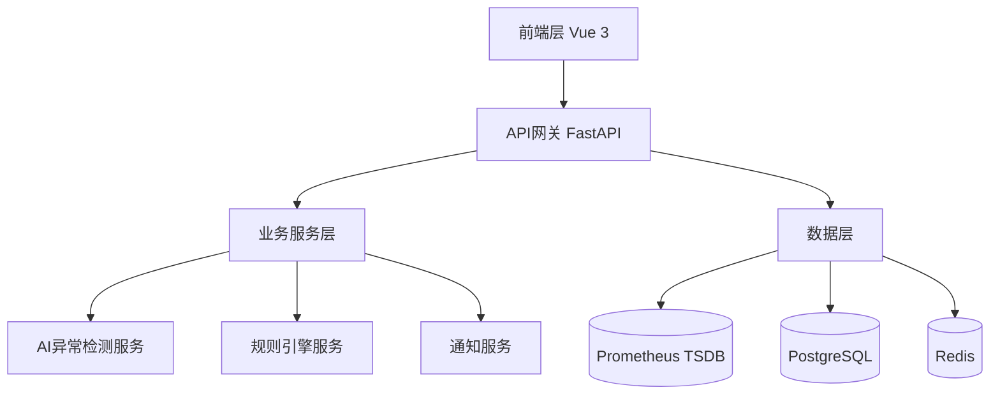

# 智能监控预警系统

## 项目简介

基于Python 3.11 + Vue 3构建的专家级自动化巡检与智能预警系统，采用现代化微服务架构设计，提供AI驱动的异常检测、智能规则引擎和多渠道通知功能。系统集成了Prometheus监控数据，通过机器学习算法实现智能异常识别和预测性预警。

## 核心特性

🔥 **核心功能**
- 🤖 **AI异常检测**: 集成Isolation Forest、Z-Score、统计学方法等多种算法
- 📊 **实时数据可视化**: 基于ECharts 5的高性能图表渲染，支持大数据量展示
- 🔧 **智能规则引擎**: 灵活的规则配置和条件组合，支持复杂业务逻辑
- 📱 **多渠道通知**: 支持Slack、邮件、Webhook等多种通知方式
- 🎯 **预测性分析**: 时间序列预测和趋势分析
- 📈 **交互式仪表盘**: 响应式设计，支持桌面和移动端

🏗️ **技术架构**
- **后端**: Python 3.11 + FastAPI + SQLAlchemy 2.0 + Pydantic
- **前端**: Vue 3 + TypeScript + ECharts 5 + Element Plus + Pinia
- **数据存储**: PostgreSQL + Redis + Prometheus TSDB
- **AI/ML**: Scikit-learn + Pandas + NumPy + 时间序列分析
- **部署**: Docker + Docker Compose + Nginx

## 项目结构

```
smart-monitoring/
├── docs/                    # 📚 项目文档
│   ├── architecture.md      # 架构设计文档
│   ├── api.md              # API接口文档
│   ├── deployment.md       # 部署指南
│   └── github-setup.md     # GitHub上传指南
├── backend/                 # 🐍 Python后端服务
│   ├── app/                # 主应用模块
│   │   ├── api/            # API路由
│   │   ├── core/           # 核心配置
│   │   ├── models/         # 数据模型
│   │   ├── services/       # 业务服务
│   │   └── utils/          # 工具函数
│   ├── alembic/            # 数据库迁移
│   ├── tests/              # 测试用例
│   ├── requirements.txt    # Python依赖
│   ├── Dockerfile          # 容器配置
│   └── main.py            # 应用入口
├── frontend/               # 🎨 Vue前端应用
│   ├── src/               # 源代码
│   │   ├── api/           # API接口
│   │   ├── components/    # Vue组件
│   │   ├── views/         # 页面视图
│   │   ├── stores/        # Pinia状态管理
│   │   ├── router/        # 路由配置
│   │   ├── utils/         # 工具函数
│   │   └── styles/        # 样式文件
│   ├── public/            # 静态资源
│   ├── package.json       # 依赖配置
│   ├── vite.config.ts     # 构建配置
│   └── Dockerfile         # 容器配置
├── deploy/                 # 🚀 部署配置
│   ├── prometheus/        # Prometheus配置
│   ├── grafana/          # Grafana配置
│   ├── nginx/            # Nginx配置
│   └── k8s/              # Kubernetes配置
├── scripts/               # 🔧 脚本工具
│   ├── init-db.py        # 数据库初始化
│   ├── seed-data.py      # 种子数据
│   └── backup.sh         # 备份脚本
├── docker-compose.yml     # 🐳 容器编排
├── docker-compose.prod.yml # 生产环境编排
├── .env.example          # 环境配置示例
├── .gitignore           # Git忽略文件
└── README.md            # 项目说明
```

## 系统功能详解

### 🎯 核心模块

#### 1. AI异常检测模块
- **多算法支持**: Isolation Forest、Z-Score、统计学方法
- **特征工程**: 自动提取时间序列特征，包括滑动窗口统计、变化率、趋势分析
- **智能评分**: 基于异常分数自动评估严重程度（低、中、高、严重）
- **预测分析**: 支持时间序列预测和趋势识别

#### 2. 规则引擎模块
- **灵活配置**: 支持复杂的条件组合逻辑（AND、OR、NOT）
- **多种操作符**: 大于、小于、等于、不等于等比较操作
- **冷却机制**: 防止告警风暴，支持自定义冷却时间
- **执行统计**: 详细的规则执行历史和性能监控

#### 3. 数据可视化模块
- **实时图表**: 基于ECharts 5的高性能图表渲染
- **多维度展示**: 支持折线图、柱状图、饼图等多种图表类型
- **交互功能**: 支持缩放、筛选、钻取等交互操作
- **响应式设计**: 自适应不同屏幕尺寸

#### 4. 通知服务模块
- **多渠道支持**: Slack、邮件、Webhook等通知方式
- **模板化消息**: 支持自定义消息模板和变量替换
- **告警聚合**: 智能去重和告警合并
- **发送统计**: 通知发送成功率和失败重试机制

### 🚀 性能优化特性
- **虚拟滚动**: 支持大数据量表格和列表展示
- **懒加载**: 图片和组件按需加载，提升页面性能
- **缓存机制**: Redis缓存和内存缓存优化
- **连接池**: 数据库连接池管理，支持高并发访问
- **异步处理**: 全异步架构，提升系统吞吐量

## 快速开始

### 环境要求
- **Python**: 3.11+ (推荐使用3.11.5)
- **Node.js**: 22.11+ (推荐使用LTS版本)
- **Docker**: 23+ (用于容器化部署)
- **PostgreSQL**: 15+ (数据存储)
- **Redis**: 7+ (缓存和会话存储)
- **Prometheus**: 2.40+ (监控数据收集)

### 本地开发

1. **克隆项目**
   ```bash
   git clone https://github.com/rait-winter/smart-monitoring-system.git
   cd smart-monitoring-system
   ```

2. **环境配置**
   ```bash
   # 复制环境配置文件
   cp .env.example .env
   
   # 编辑配置文件，设置必要的环境变量
   vim .env
   ```

3. **启动开发环境**
   ```bash
   # 使用Docker Compose启动所有服务
   docker-compose up -d
   
   # 或者分别启动各个服务
   # 启动后端服务
   cd backend && python main.py
   
   # 启动前端服务
   cd frontend && npm run dev
   ```

4. **访问应用**
   - 🌐 **前端界面**: http://localhost:3000
   - 📚 **API文档**: http://localhost:8000/api/docs
   - 📊 **Prometheus**: http://localhost:9090
   - 📈 **Grafana**: http://localhost:3001
   - 🔍 **系统健康检查**: http://localhost:8000/health

### 生产部署

```bash
# 生产环境部署
docker-compose -f docker-compose.prod.yml up -d

# 或者使用Kubernetes部署
kubectl apply -f deploy/k8s/
```

## API使用指南

### 核心API端点

#### 1. 系统健康检查
```bash
# 检查系统状态
curl http://localhost:8000/health

# 响应示例
{
  "success": true,
  "message": "系统运行正常",
  "data": {
    "service": "智能监控预警系统",
    "version": "2.0.0",
    "environment": "development",
    "uptime_seconds": 3600.5
  }
}
```

#### 2. AI异常检测
```bash
# 执行异常检测
curl -X POST http://localhost:8000/api/v1/anomaly-detection \
  -H "Content-Type: application/json" \
  -d '{
    "data": [
      {"timestamp": "2025-09-06T10:00:00Z", "value": 75.5},
      {"timestamp": "2025-09-06T10:01:00Z", "value": 85.2},
      {"timestamp": "2025-09-06T10:02:00Z", "value": 95.8}
    ],
    "algorithm": "isolation_forest",
    "sensitivity": 0.8
  }'
```

#### 3. 规则管理
```bash
# 创建监控规则
curl -X POST http://localhost:8000/api/v1/rules \
  -H "Content-Type: application/json" \
  -d '{
    "name": "CPU使用率告警",
    "description": "当CPU使用率超过80%时触发告警",
    "conditions": [
      {
        "metric_query": "cpu_usage_percent",
        "operator": "greater_than",
        "threshold": 80.0,
        "duration_minutes": 5
      }
    ],
    "severity": "high",
    "notification_channels": ["slack", "email"],
    "cooldown_minutes": 10
  }'
```

#### 4. 指标查询
```bash
# 查询Prometheus指标
curl "http://localhost:8000/api/v1/metrics/query?query=cpu_usage_percent&start=2025-09-06T00:00:00Z&end=2025-09-06T23:59:59Z"
```

## 配置说明

### 环境变量配置

创建 `.env` 文件并配置以下关键参数：

```bash
# 应用基础配置
APP_NAME=智能监控预警系统
APP_VERSION=2.0.0
DEBUG=true
ENVIRONMENT=development

# 数据库配置
POSTGRES_SERVER=localhost
POSTGRES_USER=monitoring
POSTGRES_PASSWORD=your_password
POSTGRES_DB=smart_monitoring

# Redis配置
REDIS_HOST=localhost
REDIS_PORT=6379
REDIS_PASSWORD=your_redis_password

# Prometheus配置
PROMETHEUS_URL=http://localhost:9090
PROMETHEUS_TIMEOUT=30

# AI/ML配置
AI_MODEL_PATH=./models
AI_BATCH_SIZE=1000
AI_CACHE_TTL=300

# 通知服务配置
SLACK_WEBHOOK_URL=https://hooks.slack.com/services/your/webhook/url
SMTP_HOST=smtp.gmail.com
SMTP_PORT=587
SMTP_USERNAME=your_email@gmail.com
SMTP_PASSWORD=your_app_password

# 安全配置
SECRET_KEY=your-very-secure-secret-key-change-in-production
ACCESS_TOKEN_EXPIRE_MINUTES=30
```

### 数据库初始化

```bash
# 初始化数据库表结构
cd backend
python scripts/init-db.py

# 或者使用Alembic迁移
alembic upgrade head
```

### Prometheus配置

确保Prometheus正确配置并收集目标指标：

```yaml
# prometheus.yml
global:
  scrape_interval: 15s

scrape_configs:
  - job_name: 'node-exporter'
    static_configs:
      - targets: ['localhost:9100']
  
  - job_name: 'smart-monitoring'
    static_configs:
      - targets: ['localhost:8000']
    metrics_path: '/metrics'
```

## 系统架构

### 分层架构设计



### 核心模块

1. **数据采集层**
   - Prometheus指标收集
   - 多维度时间序列数据
   - 实时数据流处理

2. **AI分析层**
   - 多算法异常检测
   - 时间序列预测
   - 智能阈值调整

3. **规则引擎**
   - 动态规则配置
   - 条件组合逻辑
   - 执行历史追踪

4. **通知系统**
   - 多渠道告警
   - 模板化消息
   - 告警聚合去重

5. **可视化前端**
   - 高性能图表渲染
   - 实时数据更新
   - 响应式设计

## 开发规范

### 代码质量
- Python: Black + Flake8 + MyPy
- Vue: ESLint + Prettier + TypeScript
- 单元测试覆盖率 > 90%
- API文档自动生成

### Git工作流
- 主分支: `main` 
- 功能分支: `feature/功能名称`
- 发布分支: `release/版本号`
- 热修复: `hotfix/问题描述`

## 🚀 最新优化 (2025-09-06)

### ✅ 已完成的优化
- **性能优化**: 添加虚拟滚动、懒加载、连接池优化
- **安全增强**: 修复硬编码密码、优化CORS配置、统一错误处理
- **代码质量**: 修复重复导入、添加性能监控中间件
- **可维护性**: 统一错误处理、结构化日志、性能监控API

### 📊 性能提升
- 数据库连接池优化，支持高并发访问
- 前端虚拟滚动，支持大数据量展示
- AI服务缓存优化，提升响应速度
- 统一错误处理，提升系统稳定性

### 🔒 安全改进
- 移除硬编码敏感信息
- 优化CORS安全配置
- 添加请求性能监控
- 统一异常处理和日志记录

## 故障排除

### 常见问题及解决方案

#### 1. 数据库连接问题
**问题**: 数据库连接失败
```bash
# 检查PostgreSQL服务状态
systemctl status postgresql

# 检查数据库配置
psql -h localhost -U monitoring -d smart_monitoring

# 解决方案
# 1. 确保PostgreSQL服务正在运行
# 2. 检查.env文件中的数据库配置
# 3. 验证数据库用户权限
```

#### 2. Prometheus连接问题
**问题**: 无法连接到Prometheus
```bash
# 检查Prometheus服务
curl http://localhost:9090/api/v1/query?query=up

# 解决方案
# 1. 确保Prometheus服务正在运行
# 2. 检查PROMETHEUS_URL配置
# 3. 验证网络连接和防火墙设置
```

#### 3. AI模型加载问题
**问题**: AI模型加载失败
```bash
# 检查模型目录
ls -la ./models/

# 解决方案
# 1. 确保AI_MODEL_PATH目录存在
# 2. 检查模型文件权限
# 3. 验证Python依赖包安装
```

#### 4. 前端构建问题
**问题**: 前端构建失败
```bash
# 清理并重新安装依赖
cd frontend
rm -rf node_modules package-lock.json
npm install

# 解决方案
# 1. 确保Node.js版本符合要求
# 2. 清理缓存和依赖
# 3. 检查网络连接
```

### 调试技巧

```bash
# 启用详细日志
export DEBUG=true
export LOG_LEVEL=DEBUG

# 查看实时日志
tail -f logs/app.log

# 检查服务健康状态
curl http://localhost:8000/health

# 查看Prometheus指标
curl http://localhost:8000/metrics
```

### 性能优化建议

1. **数据库优化**
   - 为常用查询字段添加索引
   - 定期清理历史数据
   - 使用连接池管理

2. **缓存优化**
   - 合理设置Redis缓存TTL
   - 使用内存缓存减少数据库查询
   - 启用Gzip压缩

3. **前端优化**
   - 启用虚拟滚动处理大数据
   - 使用懒加载减少初始加载时间
   - 压缩静态资源

## 版本计划

### V1.0 (MVP) 🎯
- [x] 基础架构搭建
- [x] Prometheus数据接入
- [x] 基础告警规则
- [x] Web仪表盘界面

### V2.0 (智能化) 🤖
- [x] AI异常检测算法
- [x] 预测性预警
- [x] 多渠道通知
- [x] 高级数据可视化
- [x] 性能监控和优化
- [x] 统一错误处理

### V3.0 (企业级) 🏢  
- [ ] 多租户支持
- [ ] 高可用部署
- [ ] 微服务架构
- [ ] 容器化部署

## 贡献指南

1. Fork 本仓库
2. 创建功能分支 (`git checkout -b feature/AmazingFeature`)
3. 提交更改 (`git commit -m 'Add some AmazingFeature'`)
4. 推送到分支 (`git push origin feature/AmazingFeature`)
5. 创建 Pull Request

## 许可证

本项目采用 MIT 许可证 - 查看 [LICENSE](LICENSE) 文件了解详情。

## 相关链接

- 🔗 **GitHub仓库**: https://github.com/rait-winter/smart-monitoring-system
- 📚 **项目文档**: [docs/](./docs/)
- 🏗️ **架构设计**: [docs/architecture.md](./docs/architecture.md)
- 🚀 **部署指南**: [docs/deployment.md](./docs/deployment.md)
- 📋 **GitHub设置**: [docs/github-setup.md](./docs/github-setup.md)

## 技术支持

- 📧 Issues: https://github.com/rait-winter/smart-monitoring-system/issues
- 💡 Discussions: https://github.com/rait-winter/smart-monitoring-system/discussions
- 📖 Wiki: https://github.com/rait-winter/smart-monitoring-system/wiki

---

**让监控更智能，让运维更轻松！** 🚀