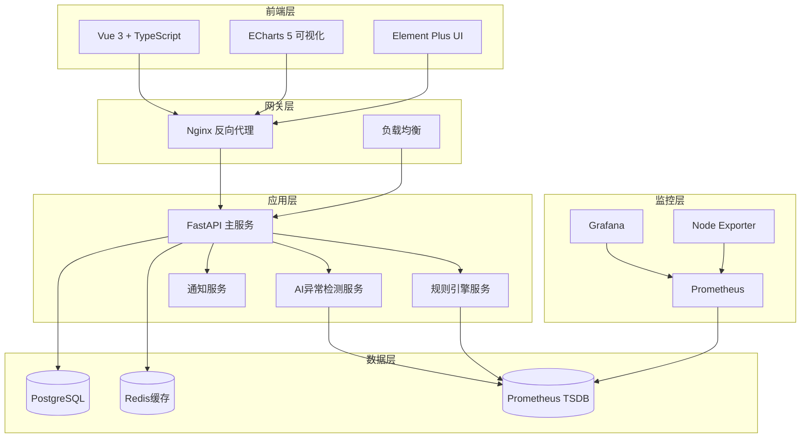
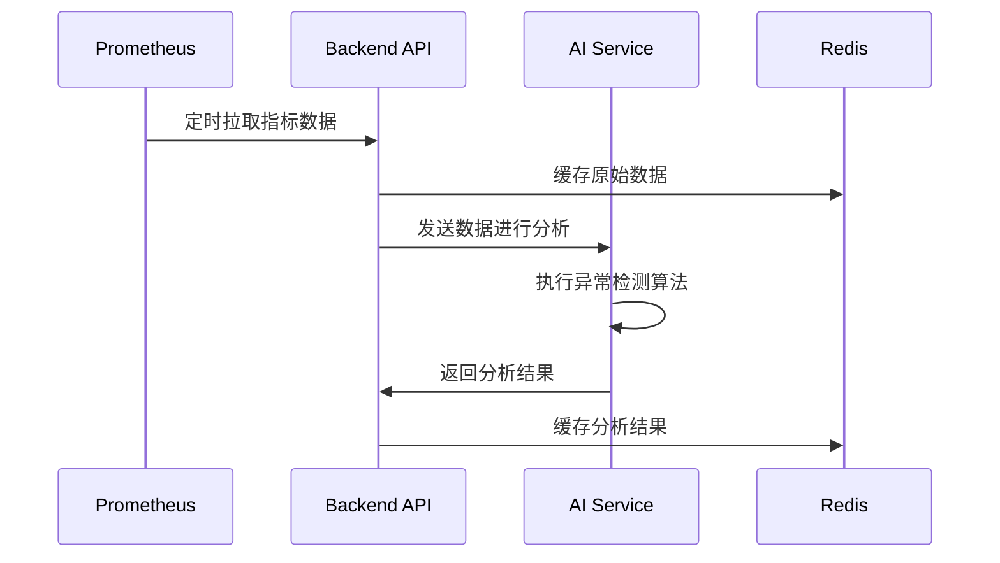
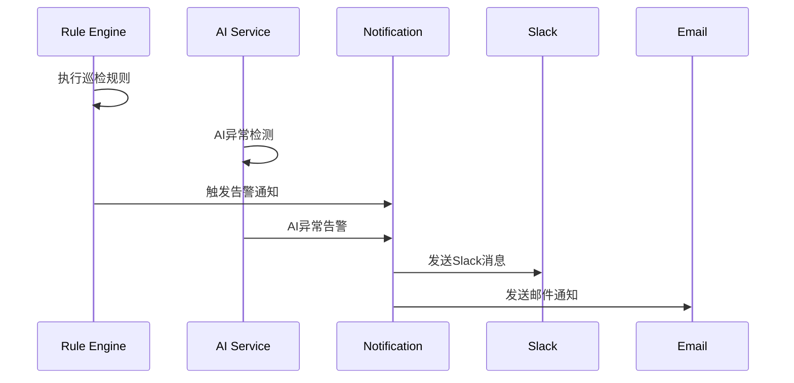

# 系统架构设计文档

## 概述

智能监控预警系统采用现代化的微服务架构，基于Python 3.11和Vue 3构建，提供AI驱动的异常检测和智能预警功能。

## 架构图



## 核心组件

### 1. 前端层 (Vue 3)

**技术栈**:
- Vue 3 + Composition API
- TypeScript 5.3
- Vite 5.0 (构建工具)
- Element Plus (UI组件)
- ECharts 5 (数据可视化)
- Pinia (状态管理)

**核心特性**:
- 响应式设计，支持桌面和移动端
- 组件化开发，高度可复用
- 高性能图表渲染，支持大数据量
- 实时数据更新，WebSocket支持
- 暗色模式支持

### 2. 后端层 (FastAPI)

**技术栈**:
- Python 3.11
- FastAPI (异步Web框架)
- SQLAlchemy 2.0 (异步ORM)
- Pydantic (数据验证)
- Alembic (数据库迁移)

**核心特性**:
- 高性能异步处理
- 自动API文档生成
- 类型安全的数据验证
- 模块化架构设计
- 完整的错误处理机制

### 3. AI/ML层

**算法支持**:
- Isolation Forest (孤立森林)
- Z-Score 统计检测
- LSTM 时间序列预测
- Prophet 趋势预测
- 自定义统计算法

**特性**:
- 多算法融合检测
- 自适应阈值调整
- 时间序列模式识别
- 预测性预警
- 模型可插拔架构

### 4. 数据层

**PostgreSQL**:
- 用户认证数据
- 规则配置数据
- 告警历史记录
- 系统配置信息

**Redis**:
- 会话缓存
- API响应缓存
- 实时数据缓存
- 任务队列

**Prometheus**:
- 时间序列指标数据
- 系统性能监控
- 业务指标收集

## 系统流程

### 1. 数据采集流程



### 2. 告警处理流程



## 性能优化

### 前端优化

1. **组件级别优化**
   - 使用 `<Suspense>` 异步组件加载
   - 虚拟滚动处理大列表
   - 图片懒加载
   - 组件缓存 `<KeepAlive>`

2. **图表性能优化**
   - ECharts大数据模式
   - Canvas渲染引擎
   - 数据抽样和聚合
   - 分层渲染技术

3. **网络优化**
   - HTTP/2 多路复用
   - 资源预加载
   - CDN加速
   - Gzip压缩

### 后端优化

1. **异步处理**
   - FastAPI异步路由
   - 数据库连接池
   - 缓存机制
   - 批量处理

2. **数据库优化**
   - 索引优化
   - 查询优化
   - 连接池管理
   - 读写分离

3. **缓存策略**
   - Redis分布式缓存
   - 应用级缓存
   - 查询结果缓存
   - 静态资源缓存

## 安全架构

### 1. 认证授权
- JWT Token认证
- 基于角色的访问控制(RBAC)
- API访问限制
- 会话管理

### 2. 数据安全
- 密码哈希存储
- 敏感数据加密
- SQL注入防护
- XSS攻击防护

### 3. 网络安全
- HTTPS强制加密
- CORS跨域控制
- 请求频率限制
- IP白名单

## 监控体系

### 1. 应用监控
- Prometheus指标收集
- Grafana可视化监控
- 错误追踪(Sentry)
- 性能分析

### 2. 基础设施监控
- 服务器资源监控
- 数据库性能监控
- 网络流量监控
- 容器状态监控

### 3. 业务监控
- 用户行为分析
- 接口调用统计
- 告警处理效率
- 系统可用性

## 扩展性设计

### 1. 水平扩展
- 微服务架构
- 负载均衡
- 数据库分片
- 缓存集群

### 2. 模块扩展
- 插件化架构
- 动态模块加载
- API版本管理
- 向后兼容

### 3. 云原生支持
- 容器化部署
- Kubernetes编排
- 服务网格
- 自动扩缩容

## 部署架构

### 开发环境
```
Docker Compose
├── Backend (Python)
├── Frontend (Vue)
├── PostgreSQL
├── Redis
├── Prometheus
└── Grafana
```

### 生产环境
```
Kubernetes Cluster
├── Ingress Controller
├── Backend Pods (多副本)
├── Frontend Pods (多副本)
├── Database Cluster
├── Redis Cluster
└── Monitoring Stack
```

## 技术决策

### 为什么选择FastAPI？
1. 高性能异步处理
2. 自动API文档生成
3. 类型安全支持
4. 现代Python特性
5. 活跃的社区支持

### 为什么选择Vue 3？
1. 组合式API更灵活
2. 更好的TypeScript支持
3. 更小的包体积
4. 更快的渲染性能
5. 优秀的开发体验

### 为什么选择ECharts？
1. 丰富的图表类型
2. 优秀的性能表现
3. 强大的交互能力
4. 完善的文档
5. 活跃的社区

## 未来规划

### 短期目标 (3-6个月)
- [ ] 完善AI异常检测算法
- [ ] 增加更多数据源支持
- [ ] 优化前端性能
- [ ] 完善监控告警

### 长期目标 (6-12个月)  
- [ ] 微服务架构深化
- [ ] 云原生部署
- [ ] 多租户支持
- [ ] 边缘计算集成